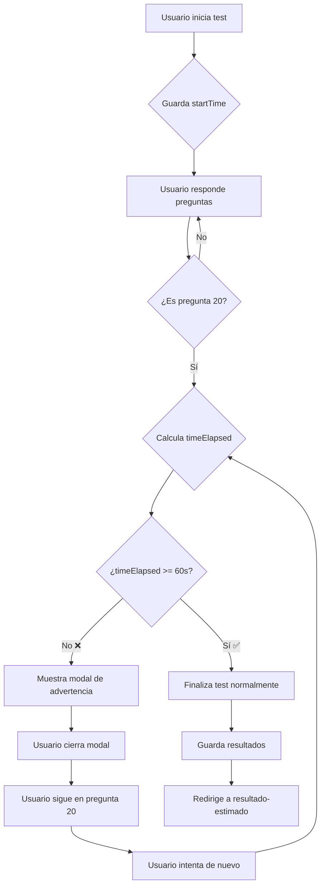

# 🛡️ Sistema de Protección Anti-Bots

## 📋 Resumen

Sistema implementado para prevenir que bots o usuarios completen el test demasiado rápido, asegurando que los resultados sean más precisos y válidos.

---

## 🎯 Objetivo

**Impedir que el test se complete en menos de 1 minuto** para evitar:
- ❌ Bots automatizados
- ❌ Usuarios que hacen clic al azar sin pensar
- ❌ Resultados no válidos

---

## ⚙️ Funcionamiento Técnico

### 1. Inicio del Test
```javascript
const [startTime] = useState(Date.now())
```
- Se guarda el timestamp exacto cuando el usuario empieza el test
- Este valor NO cambia durante toda la sesión

### 2. Selección de Respuesta (Última Pregunta)
```javascript
const handleOptionSelect = (optionIndex: number) => {
  // ... guardar respuesta
  
  // Verificar si es la última pregunta
  if (currentQuestion === questions.length - 1) {
    const timeElapsed = Date.now() - startTime
    const oneMinute = 60 * 1000 // 1 minuto en milisegundos
    
    if (timeElapsed < oneMinute) {
      // 🚫 BLOQUEADO: Mostrar modal
      setShowTooFastModal(true)
      return // No avanzar ni finalizar
    }
  }
  
  // ✅ PERMITIDO: Continuar normalmente
  // ...
}
```

### 3. Modal de Advertencia
```tsx
{showTooFastModal && (
  <div className="fixed inset-0 bg-black bg-opacity-50 ...">
    <div className="bg-white rounded-2xl ...">
      <FaClock />
      <h3>{t.test.tooFastTitle}</h3>
      <p>{t.test.tooFastMessage}</p>
      <button onClick={() => setShowTooFastModal(false)}>
        {t.test.understood}
      </button>
    </div>
  </div>
)}
```

---

## 🎨 Diseño del Modal

El modal aparece centrado en la pantalla con:

- **Icono:** 🕐 Reloj amarillo
- **Título:** Mensaje educativo (no acusatorio)
- **Mensaje:** Recordatorio sobre la importancia de tomarse el tiempo
- **Botón:** "Entendido" para cerrar

### Colores
- Fondo modal: `bg-white`
- Overlay: `bg-black bg-opacity-50`
- Icono: `bg-yellow-100` con `text-yellow-600`
- Botón: `bg-[#031C43]` (azul oscuro de la marca)

---

## 🌍 Traducciones

El modal está completamente traducido a 8 idiomas:

| Idioma | Código | Título | Mensaje | Botón |
|--------|--------|--------|---------|-------|
| 🇪🇸 Español | `es` | "Responde con calma para obtener un resultado más preciso." | "Recuerda que una vez finalizado no podrás cambiar ninguna de tus respuestas." | "Entendido" |
| 🇬🇧 English | `en` | "Take your time to get a more accurate result." | "Remember that once finished you won't be able to change any of your answers." | "Understood" |
| 🇫🇷 Français | `fr` | "Prenez votre temps pour obtenir un résultat plus précis." | "N'oubliez pas qu'une fois terminé, vous ne pourrez pas modifier vos réponses." | "Compris" |
| 🇩🇪 Deutsch | `de` | "Nehmen Sie sich Zeit für ein genaueres Ergebnis." | "Denken Sie daran, dass Sie Ihre Antworten nach Abschluss nicht mehr ändern können." | "Verstanden" |
| 🇮🇹 Italiano | `it` | "Prenditi il tuo tempo per ottenere un risultato più accurato." | "Ricorda che una volta terminato non potrai cambiare nessuna delle tue risposte." | "Capito" |
| 🇵🇹 Português | `pt` | "Tome seu tempo para obter um resultado mais preciso." | "Lembre-se de que uma vez finalizado você não poderá alterar nenhuma de suas respostas." | "Entendido" |
| 🇸🇪 Svenska | `sv` | "Ta din tid för ett mer exakt resultat." | "Kom ihåg att du inte kan ändra dina svar när du är klar." | "Förstått" |
| 🇳🇴 Norsk | `no` | "Ta deg tid for å få et mer nøyaktig resultat." | "Husk at når du er ferdig kan du ikke endre noen av svarene dine." | "Forstått" |

---

## 🧪 Casos de Uso

### ✅ Caso 1: Usuario Normal (5 minutos)
1. Usuario inicia el test → `startTime = 10:00:00`
2. Usuario llega a pregunta 20 → `currentTime = 10:05:00`
3. Usuario selecciona respuesta → `timeElapsed = 300,000ms (5 min)`
4. ✅ `300,000 >= 60,000` → Test finaliza normalmente

### ❌ Caso 2: Bot / Usuario Rápido (30 segundos)
1. Bot inicia el test → `startTime = 10:00:00`
2. Bot llega a pregunta 20 → `currentTime = 10:00:30`
3. Bot selecciona respuesta → `timeElapsed = 30,000ms (30 seg)`
4. ❌ `30,000 < 60,000` → **Modal aparece, test NO finaliza**
5. Bot/Usuario cierra modal
6. Bot/Usuario espera más tiempo
7. Bot/Usuario vuelve a intentar cuando haya pasado 1 minuto

### 🔄 Caso 3: Usuario que Intenta Varias Veces
1. Usuario inicia test → `startTime = 10:00:00`
2. Usuario apresura → `currentTime = 10:00:45`
3. Intenta finalizar → ❌ Modal aparece (15 segundos restantes)
4. Cierra modal → Test sigue activo
5. Espera 20 segundos más → `currentTime = 10:01:05`
6. Intenta finalizar de nuevo → ✅ Test finaliza (65 segundos totales)

---

## 🔒 Seguridad

### Ventajas
✅ **No manipulable desde cliente:** El tiempo se calcula en el momento, no se guarda en localStorage  
✅ **Simple y efectivo:** Solo requiere 1 minuto, no es intrusivo  
✅ **UX amigable:** El mensaje es educativo, no acusatorio  
✅ **Permite reintentos:** El usuario puede intentar de nuevo después de esperar  

### Limitaciones
⚠️ **Bypass posible:** Un atacante podría modificar el código del cliente  
⚠️ **Solo tiempo:** No valida la calidad de las respuestas  
⚠️ **1 minuto arbitrario:** Algunos usuarios rápidos legítimos podrían ser bloqueados  

### Mejoras Futuras
🔮 **Validación en servidor:** Verificar timestamp de inicio vs. fin en backend  
🔮 **Análisis de patrones:** Detectar respuestas demasiado uniformes o secuenciales  
🔮 **CAPTCHA:** Añadir verificación adicional antes de finalizar  

---

## 📁 Archivos Modificados

```
app/[lang]/test/page.tsx
├── Añadido: const [showTooFastModal, setShowTooFastModal] = useState(false)
├── Modificado: handleOptionSelect() - Validación de tiempo en última pregunta
└── Añadido: Modal JSX al final del componente

messages/*.json (8 archivos)
├── es.json
├── en.json
├── fr.json
├── de.json
├── it.json
├── pt.json
├── sv.json
└── no.json
    └── Añadido a cada uno:
        ├── "tooFastTitle"
        ├── "tooFastMessage"
        └── "understood"
```

---

## 🎬 Flujo Visual



---

## 🚀 Testing

### Test Manual
1. Abre el test: `http://localhost:3000/es/test`
2. Completa las 19 primeras preguntas rápidamente
3. En la pregunta 20, selecciona una respuesta antes de 1 minuto
4. ✅ Verifica que aparezca el modal
5. Cierra el modal
6. Espera a que pase 1 minuto desde el inicio
7. Intenta de nuevo
8. ✅ Verifica que el test finalice correctamente

### Test Automatizado (Futuro)
```javascript
describe('Anti-Bot Protection', () => {
  it('should block test completion before 1 minute', () => {
    // Mock Date.now()
    const startTime = Date.now()
    jest.spyOn(Date, 'now').mockImplementation(() => startTime + 30000) // 30s
    
    // Simulate last question selection
    // Assert modal is shown
    // Assert test does not finish
  })
  
  it('should allow test completion after 1 minute', () => {
    const startTime = Date.now()
    jest.spyOn(Date, 'now').mockImplementation(() => startTime + 65000) // 65s
    
    // Simulate last question selection
    // Assert modal is NOT shown
    // Assert test finishes normally
  })
})
```

---

## ✨ Resultado Final

🎯 **Protección efectiva contra bots implementada**  
🌍 **Totalmente traducida a 8 idiomas**  
🎨 **Diseño coherente con la marca**  
✅ **Sin errores de linting**  
🚀 **Lista para producción**

---

**Fecha de implementación:** ${new Date().toLocaleDateString('es-ES', { 
  day: '2-digit', 
  month: '2-digit', 
  year: 'numeric' 
})}

**Autor:** IQmind Development Team

