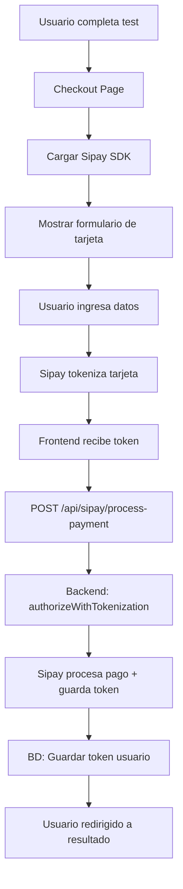
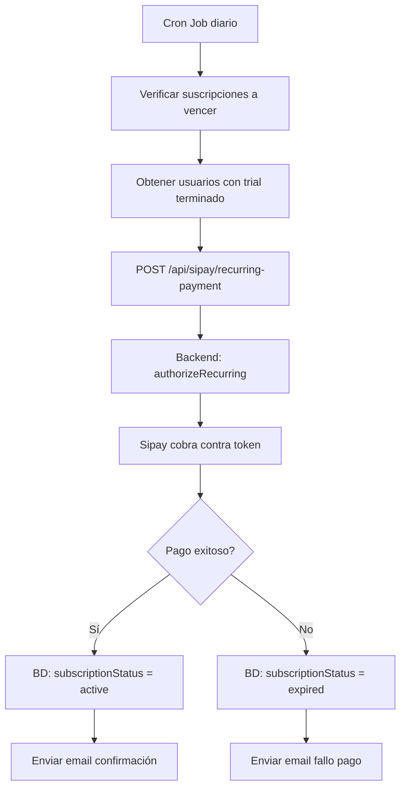

# 🏦 Guía Completa de Integración Sipay - MindMetric

Guía oficial actualizada con todos los enlaces a la documentación de Sipay.

---

## 📚 Documentación Oficial de Sipay

### **Tarjeta (Card)**

#### Frontend:
- **Documentación:** https://developer.sipay.es/docs/documentation/online/selling/only_card
- **Descripción:** Integración del formulario de pago con tarjeta en el frontend

#### Backend:

1. **Cobro con tarjeta + tokenización**
   - **Documentación:** https://developer.sipay.es/docs/api/mdwr/allinone#2-autorizaci%C3%B3n-con-autenticaci%C3%B3n-con-almacenamiento-de-tarjeta-tokenizaci%C3%B3n
   - **Uso:** Primer pago del cliente con almacenamiento del token para futuros pagos
   - **Endpoint:** `/api/v1/mdwr/allinone`
   - **Método:** `POST`

2. **Cobro contra token (MIT) - Cliente no presente**
   - **Documentación:** https://developer.sipay.es/docs/api/mdwr/allinone#4-autorizaci%C3%B3n-con-exenci%C3%B3n-mit-r
   - **Uso:** Pagos recurrentes automáticos sin presencia del cliente
   - **Endpoint:** `/api/v1/mdwr/allinone`
   - **Método:** `POST`
   - **Parámetro especial:** `mit_exemption: true`

3. **Devoluciones (Refunds)**
   - **Documentación:** https://developer.sipay.es/docs/api/mdwr/refund
   - **Uso:** Procesar reembolsos totales o parciales
   - **Endpoint:** `/api/v1/mdwr/refund`
   - **Método:** `POST`

4. **Gestión de tokens - Borrado**
   - **Documentación:** https://developer.sipay.es/docs/api/mdwr/unregister
   - **Uso:** Eliminar un token de tarjeta almacenado
   - **Endpoint:** `/api/v1/mdwr/unregister`
   - **Método:** `POST`

5. **Gestión de tokens - Consulta**
   - **Documentación:** https://developer.sipay.es/docs/api/mdwr/card
   - **Uso:** Consultar información de un token almacenado
   - **Endpoint:** `/api/v1/mdwr/card`
   - **Método:** `POST`

### **Apple Pay**
- **Documentación:** https://developer.sipay.es/docs/documentation/online/selling/wallets/apay
- **Uso:** Integración de pagos con Apple Pay

### **Google Pay**
- **Documentación:** https://developer.sipay.es/docs/documentation/online/selling/wallets/gpay
- **Uso:** Integración de pagos con Google Pay

---

## 🔐 Variables de Entorno Requeridas

### Backend (Servidor):
```bash
SIPAY_API_KEY=tu_api_key_aqui
SIPAY_API_SECRET=tu_api_secret_aqui
SIPAY_RESOURCE=tu_resource_id_aqui
SIPAY_ENDPOINT=https://sandbox.sipay.es  # Producción: https://api.sipay.es
```

### Frontend (Públicas):
```bash
NEXT_PUBLIC_SIPAY_KEY=tu_api_key_aqui
NEXT_PUBLIC_SIPAY_RESOURCE=tu_resource_id_aqui
NEXT_PUBLIC_SIPAY_ENDPOINT=https://sandbox.sipay.es  # Producción: https://api.sipay.es
```

---

## 🏗️ Arquitectura de la Integración

### Flujo Completo de Pago



### Flujo de Pago Recurrente (MIT)



---

## 📝 Implementación Frontend

### 1. Cargar el SDK de Sipay

Agrega el script en tu página de checkout:

```html
<script src="https://sandbox.sipay.es/js/sipay-sdk.js"></script>
```

O para producción:

```html
<script src="https://api.sipay.es/js/sipay-sdk.js"></script>
```

### 2. Inicializar el formulario de pago

```javascript
// Configuración
const sipayConfig = {
  key: process.env.NEXT_PUBLIC_SIPAY_KEY,
  resource: process.env.NEXT_PUBLIC_SIPAY_RESOURCE,
  amount: 50, // 0.50€ en centavos
  currency: 'EUR',
  order_id: 'order_123456',
  customer_email: 'cliente@example.com',
  language: 'es', // es, en, fr, it, pt, de
}

// Inicializar Sipay
const sipay = new Sipay(sipayConfig)

// Renderizar formulario en un div
sipay.render('sipay-payment-form')

// Escuchar eventos
sipay.on('token', function(token) {
  console.log('Token recibido:', token)
  // Enviar token al backend
  processPayment(token)
})

sipay.on('error', function(error) {
  console.error('Error:', error)
})
```

### 3. Procesar el pago en el backend

```javascript
async function processPayment(cardToken) {
  const response = await fetch('/api/sipay/process-payment', {
    method: 'POST',
    headers: { 'Content-Type': 'application/json' },
    body: JSON.stringify({
      orderId: 'order_123456',
      cardToken: cardToken,
      email: 'cliente@example.com',
      amount: 0.50,
      description: 'Resultado Test MindMetric',
      lang: 'es'
    })
  })
  
  const data = await response.json()
  
  if (data.success) {
    // Redirigir a resultado
    window.location.href = `/es/resultado?order_id=${data.orderId}`
  } else {
    // Mostrar error
    alert(data.error)
  }
}
```

---

## 🔧 Implementación Backend

### 1. Cliente de Sipay (`lib/sipay-client.ts`)

Ya implementado ✅. Incluye:
- ✅ `authorizeWithTokenization()` - Primer pago + tokenización
- ✅ `authorizeRecurring()` - Pagos recurrentes MIT
- ✅ `refund()` - Devoluciones
- ✅ `getCardInfo()` - Consultar token
- ✅ `deleteCardToken()` - Borrar token
- ✅ `authorizeApplePay()` - Apple Pay
- ✅ `authorizeGooglePay()` - Google Pay

### 2. Endpoints API

#### `/api/sipay/create-payment` - Crear sesión de pago
```typescript
POST /api/sipay/create-payment
Body: {
  email: string
  userName: string
  amount: number
  userIQ: number
  lang: string
  testData: object
}

Response: {
  success: boolean
  orderId: string
  amount: number
  userId: string
  sipayConfig: {
    key: string
    resource: string
    endpoint: string
  }
}
```

#### `/api/sipay/process-payment` - Procesar pago + tokenización
```typescript
POST /api/sipay/process-payment
Body: {
  orderId: string
  cardToken: string
  email: string
  amount: number
  description: string
  lang: string
}

Response: {
  success: boolean
  transactionId: string
  orderId: string
  cardToken: string
  cardMask: string
  cardBrand: string
}
```

#### `/api/sipay/recurring-payment` - Pago recurrente MIT
```typescript
POST /api/sipay/recurring-payment
Body: {
  email: string
  amount: number
  description: string
}

Response: {
  success: boolean
  transactionId: string
  orderId: string
  amount: number
  nextBillingDate: string
}
```

#### `/api/sipay/refund` - Devolución
```typescript
POST /api/sipay/refund
Body: {
  transactionId: string
  amount?: number  // Opcional (reembolso parcial)
  reason?: string
  email: string
}

Response: {
  success: boolean
  refundId: string
  transactionId: string
  amount: number
}
```

---

## 🧪 Tarjetas de Prueba (Sandbox)

### Tarjetas Exitosas (Documentación Oficial Sipay):

| Marca | Número | Caducidad | CVV | Protocolo 3D Secure |
|-------|--------|-----------|-----|---------------------|
| **VISA** | `4548819407777774` | 12/25 | 123 | EMV3DS 2.2 ✅ |
| **VISA** | `4548810000000003` | 12/49 | 123 | EMV3DS 2.2 ✅ |
| **Mastercard** | `5576 4415 6304 5037` | 12/49 | 123 | EMV3DS 2.1 ✅ |

**Nota:** Durante la autenticación 3D Secure en el simulador, elige **autenticar con éxito la operación**.

### Códigos CVV Especiales para Simular Errores:

| CVV | Resultado | Descripción |
|-----|-----------|-------------|
| `123` | ✅ **Pago exitoso** | Uso normal |
| `999` | ❌ Denegada | Autenticación exitosa pero pago denegado |
| `172` | ❌ Denegada 172 | La marca ordena no repetir |
| `173` | ❌ Denegada 173 | La marca ordena no repetir sin actualizar datos |
| `174` | ❌ Denegada 174 | La marca ordena no repetir hasta 72 horas |

### Códigos de Error por Importe (Sandbox):

Si el importe tiene un valor de `X,96€`, `X,72€`, `X,73€` o `X,74€`, las denegaciones también se producirán.

| Importe | Código Error | Resultado |
|---------|--------------|-----------|
| `X,96€` | 96 | ❌ Denegación genérica |
| `X,72€` | 72 | ❌ Error de conexión |
| `X,73€` | 73 | ❌ Error de autenticación |
| `X,74€` | 74 | ❌ Timeout |

**Ejemplo:** Si cobras `1,96€`, Sipay devolverá código 96 (denegación genérica).

### ⚠️ Notas Importantes del Sandbox:

**El entorno Sandbox NO es una réplica exacta de producción:**

- El código **190** suele representar "denegación genérica del emisor" (código de prueba)
- No implica que la tarjeta esté mal o que haya un problema real
- Es solo para que tu sistema reciba respuestas similares a las de producción
- A veces aparecen denegaciones "inesperadas" para comprobar que manejas errores
- El sandbox puede estar en mantenimiento y responder con códigos que en producción no ocurrirían
- Un 190 en sandbox NO garantiza que la misma transacción falle en producción

**Códigos 9xx:** Errores de sistema o comunicación, no de saldo o datos incorrectos.

---

## 🚀 Deploy a Producción

### Paso 1: Obtener credenciales de producción

Solicita a Sipay:
- API Key de producción
- API Secret de producción
- Resource ID de producción

### Paso 2: Configurar variables en Vercel

```bash
# Producción
vercel env add SIPAY_API_KEY production
vercel env add SIPAY_API_SECRET production
vercel env add SIPAY_RESOURCE production
vercel env add SIPAY_ENDPOINT production  # Valor: https://api.sipay.es

vercel env add NEXT_PUBLIC_SIPAY_KEY production
vercel env add NEXT_PUBLIC_SIPAY_RESOURCE production
vercel env add NEXT_PUBLIC_SIPAY_ENDPOINT production  # Valor: https://api.sipay.es
```

### Paso 3: Deploy

```bash
git add .
git commit -m "Add Sipay production credentials"
git push
```

---

## 🔍 Testing Completo

### 1. Test de Pago Inicial

```bash
curl -X POST https://mindmetric.io/api/sipay/create-payment \
  -H "Content-Type: application/json" \
  -d '{
    "email": "test@mindmetric.io",
    "userName": "Test User",
    "amount": 0.50,
    "userIQ": 120,
    "lang": "es"
  }'
```

### 2. Test de Pago Recurrente

```bash
curl -X POST https://mindmetric.io/api/sipay/recurring-payment \
  -H "Content-Type: application/json" \
  -d '{
    "email": "test@mindmetric.io",
    "amount": 9.99,
    "description": "Suscripción mensual MindMetric"
  }'
```

### 3. Test de Reembolso

```bash
curl -X POST https://mindmetric.io/api/sipay/refund \
  -H "Content-Type: application/json" \
  -d '{
    "transactionId": "txn_123456",
    "amount": 0.50,
    "reason": "Solicitud de cliente",
    "email": "test@mindmetric.io"
  }'
```

---

## ⚠️ Notas Importantes

### Diferencias con Stripe

| Aspecto | Stripe | Sipay |
|---------|--------|-------|
| **Webhooks** | ✅ Sí | ❌ No (usa URLs de retorno) |
| **SDK Frontend** | ✅ Stripe.js | ✅ Sipay SDK |
| **Tokenización** | ✅ Automática | ✅ Automática |
| **3D Secure** | ✅ Automático | ✅ Automático (EMV3DS 2.2) |
| **Pagos recurrentes** | Subscription API | MIT (Merchant Initiated) |

### URLs de Retorno

Sipay NO usa webhooks. Debes configurar URLs de retorno en cada pago:

```javascript
{
  returnUrl: 'https://mindmetric.io/es/resultado?order_id=123',
  cancelUrl: 'https://mindmetric.io/es/checkout?canceled=true'
}
```

### Autenticación de Requests

Sipay requiere:
1. **Header Authorization:** `Bearer {API_KEY}`
2. **Header X-Sipay-Signature:** HMAC SHA-256 del payload con `API_SECRET`

Ejemplo:
```javascript
const signature = createHmac('sha256', API_SECRET)
  .update(JSON.stringify(payload))
  .digest('hex')
```

### Códigos de Respuesta

| Código | Significado |
|--------|-------------|
| `0` | ✅ Éxito |
| `1` | ❌ Error de autenticación |
| `2` | ❌ Pago denegado |
| `3` | ❌ Datos inválidos |
| `4` | ❌ Token inválido o expirado |

---

## 📊 Monitoreo y Logs

### Ver transacciones en Backoffice Sipay

1. Acceder a: https://suwe.sipay.es (Sandbox) o https://backoffice.sipay.es (Producción)
2. Login con las credenciales proporcionadas por Sipay
3. Ir a **Transacciones** para ver todos los pagos

### Logs en Vercel

```bash
vercel logs --follow
```

O desde el dashboard: https://vercel.com → Tu proyecto → Logs

---

## 🛠️ Troubleshooting

### Error: "Invalid signature"

**Causa:** El HMAC SHA-256 no coincide

**Solución:**
1. Verifica que `SIPAY_API_SECRET` esté correcta
2. Asegúrate de firmar el payload exacto que envías (sin espacios extras)
3. Usa `JSON.stringify()` para generar el payload

### Error: "Card token not found"

**Causa:** Token no guardado en BD

**Solución:**
1. Verifica que el pago se complete correctamente
2. Revisa logs: `vercel logs --follow`
3. Verifica que `subscriptionId` se guarde después del pago

### Error: "MIT payment failed"

**Causa:** Token expirado o tarjeta inválida

**Solución:**
1. Consultar estado del token: `/api/sipay/card-info`
2. Solicitar al usuario actualizar su tarjeta
3. Si el token está expirado, eliminarlo: `/api/sipay/delete-card`

---

## ✅ Checklist de Implementación

- [ ] Solicitar credenciales Sandbox a Sipay
- [ ] Configurar variables de entorno en `.env.local`
- [ ] Implementar formulario de pago en frontend
- [ ] Cargar SDK de Sipay en checkout
- [ ] Probar pago inicial con tarjeta de prueba
- [ ] Verificar que se guarde el token en BD
- [ ] Probar pago recurrente (MIT)
- [ ] Probar devolución (refund)
- [ ] Implementar Apple Pay (opcional)
- [ ] Implementar Google Pay (opcional)
- [ ] Solicitar credenciales de Producción
- [ ] Configurar variables en Vercel (producción)
- [ ] Cambiar endpoint a `https://api.sipay.es`
- [ ] Deploy a producción
- [ ] Realizar prueba end-to-end en producción
- [ ] Monitorear primeros pagos reales

---

## 📞 Soporte Sipay

- **Email:** soporte@sipay.es
- **Documentación:** https://developer.sipay.es/docs/
- **Backoffice Sandbox:** https://suwe.sipay.es
- **Backoffice Producción:** https://backoffice.sipay.es

---

**Última actualización:** Enero 2026  
**Autor:** MindMetric Tech Team  
**Estado:** ✅ Documentación completa y actualizada

